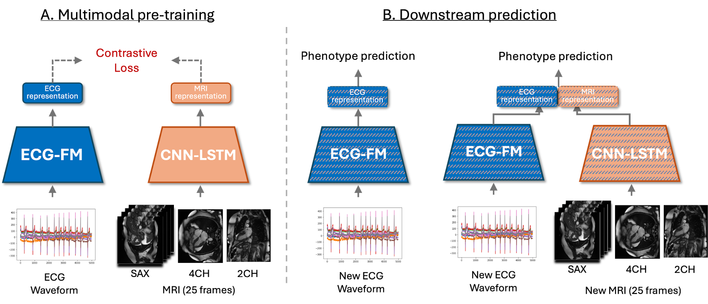

# CARDIAC-FM

<a href="https://huggingface.co/lst627/CARDIAC-FM"></a>

<p align="center">
    
</p>

## Introduction

CARDIAC-FM is a multimodal foundation model for cardiovascular risk prediction using 12-lead electrocardiogram (ECG) and cardiac magnetic resonance imaging (MRI) data.

Paper: ***[CARDIAC-FM: A Multimodal Foundation Model for Cardiovascular Risk Prediction Using ECG and Cardiac MRI](https://www.medrxiv.org/content/10.64898/2026.03.16.26348526v1)***

This repository provides code and pretrained models to:

- Train CARDIAC-FM on paired ECG–MRI data using contrastive learning  
- Fine-tune the model for downstream prediction tasks (e.g., atrial fibrillation, heart failure)  
- Run inference using different input settings depending on available data  

The model supports multiple input configurations:

- ECG only  
- ECG + MRI  
- ECG + clinical risk scores  
- ECG + MRI + clinical risk scores
## Environment
Ensure that you have NVIDIA GPUs and NCCL before installation.
```bash
git clone https://github.com/lst627/CARDIAC-FM
cd CARDIAC-FM

conda create -n cardiac python=3.9.21
conda activate cardiac
python3 -m pip install pip==24.0

pip install torch==1.11.0+cu102 torchvision==0.12.0+cu102   --extra-index-url https://download.pytorch.org/whl/cu102
pip install -r requirements.txt

cd cardiac_fm/fairseq_signals_repo
pip install --editable ./
```
To test if installation of some packages is successful:
```bash
python -c "import numpy, pandas, nibabel, wfdb, torch, torchvision, fairseq_signals; print('ok')"
```

## Training

### Stage 1: Multi-modal Contrastive Pretraining

After filling in the paths for data and model weights, you can use 

```bash
export WEIGHTS_PATH=your_model_weights_path

python stage1_CL.py \
  --lr 1e-4 \
  --epochs 20 \
  --batch_size 32 \
  --mri_csv_path your_mri_csv_path \
  --cropped_mri_path your_cropped_mri_path \
  --ecg_tsv_path your_ecg_tsv_path \
  --save_path your_save_path \
  --pt_mri_path your_mri_pretrained_path \
  --pt_ecg_path your_ecg_pretrained_path \
  --wandb \
  --dry_run

# --dry_run: runs a quick test using a small subset of data (remove for full training)
# --wandb: optional logging with Weights & Biases
```

for Stage 1 training. Note that (1) `--dry_run` is for testing the pipeline and will only use 100 samples for training, and (2) `--wandb` is for tracking the loss curves on wandb, which is not required in your training. Please remove `--dry_run` in actual training.

### Stage 2: Downstream Label Prediction Fine-tuning

#### ECG Fine-tuning for Binary Classification
```
python ecg_finetune_binary.py \
  --seed 1 \
  --epochs 20 \
  --model_name CARDIACFM \
  --label_dir your_label_dir \
  --ecg_tsv_dir your_ecg_tsv_dir \
  --ecgfm_ckpt your_ecgfm_pretrained_path \
  --save_dir your_save_dir \
  --cardiacfm_pretrained_ckpt your_cardiacfm_stage1_ckpt \
  --finetuned_ckpt your_finetuned_ckpt_path

# --label_dir: directory containing binary labels
# --ecg_tsv_dir: ECG manifest (train/valid split)
# --ecgfm_ckpt: pretrained ECG-FM checkpoint
# --cardiacfm_pretrained_ckpt: pretrained CARDIAC-FM (Stage 1) checkpoint
# --save_dir: directory to save fine-tuned models
```
#### ECG-MRI Fine-tuning for Binary Classification

```
python ecgmri_finetune_binary.py \
  --seed 1 \
  --epochs 20 \
  --label_dir your_label_dir \
  --mris_dir your_mris_dir \
  --mris_csv_dir your_mris_csv_dir \
  --ecg_tsv_dir your_ecg_tsv_dir \
  --ecgfm_ckpt your_ecgfm_pretrained_path \
  --save_dir your_save_dir \
  --cardiacfm_pretrained_ckpt your_cardiacfm_stage1_ckpt \
  --finetuned_ckpt your_finetuned_ckpt_path

# ===== Required=====
# --seed: random seed
# --epochs: number of training epochs
# --label_dir: directory containing downstream task labels
# --mris_dir: directory containing MRI data
# --mris_csv_dir: directory containing MRI metadata csv files
# --ecg_tsv_dir: directory containing ECG manifest files
# --save_dir: directory to save fine-tuned models

# ===== Optional=====
# --ecgfm_ckpt: pretrained ECG-FM checkpoint (for ECG encoder)
# --cardiacfm_pretrained_ckpt: Stage 1 contrastive pretrained CARDIAC-FM checkpoint
# --finetuned_ckpt: already fine-tuned checkpoint (e.g., trained on UKB)

# Note:Provide either --cardiacfm_pretrained_ckpt or --finetuned_ckpt depending on how you want to initialize the model.
```

## Inference

### ECG-based Inference
```
CUDA_VISIBLE_DEVICES=0 python ecg_inference_binary.py \
  --save_dir your_save_dir \
  --model_name CARDIACFM \
  --ecg_tsv_dir your_ecg_tsv_dir \
  --label_dir your_label_dir \
  --ecgfm_ckpt your_ecgfm_pretrained_path \
  --finetuned_ckpt your_finetuned_ckpt_path \
  --risk_path your_risk_path \
  --risk_model your_risk_model \
  --seed 1

# ===== Required arguments =====
# --save_dir: directory to save inference results
# --model_name: model to use (ECGFM or CARDIACFM)
# --ecg_tsv_dir: ECG manifest directory (test data)
# --label_dir: directory containing labels for evaluation
# --finetuned_ckpt: fine-tuned model checkpoint for inference

# ===== Optional arguments =====
# --ecgfm_ckpt: pretrained ECG-FM checkpoint (needed for model initialization)
# --risk_path: path to risk factor file (optional, only if using risk score)
# --risk_model: risk model name (e.g., AF or HF), must match risk_path
```
### ECG+MRI-based Inference

```
CUDA_VISIBLE_DEVICES=0 python ecgmri_test_binary.py \
  --label_dir your_label_dir \
  --mris_dir your_mris_dir \
  --mris_csv_dir your_mris_csv_dir \
  --ecg_tsv_dir your_ecg_tsv_dir \
  --ecgfm_ckpt your_ecgfm_pretrained_path \
  --save_dir your_save_dir \
  --finetuned_ckpt your_finetuned_ckpt_path \
  --risk_path your_risk_path \
  --risk_model your_risk_model \
  --seed 1

# ===== Required arguments =====
# --label_dir: directory containing downstream task labels
# --mris_dir: directory containing MRI data
# --mris_csv_dir: directory containing MRI csv/metadata files
# --ecg_tsv_dir: directory containing ECG manifest files
# --save_dir: directory used to save inference results
# --finetuned_ckpt: fine-tuned multimodal model checkpoint for inference

# ===== Optional arguments =====
# --ecgfm_ckpt: pretrained ECG-FM checkpoint used for ECG encoder initialization
# --risk_path: path to risk factor file (optional, only if using risk score)
# --risk_model: risk model to use (e.g., AF or HF), must match risk_path
# --seed: random seed
```

## License
This project is licensed under the MIT License - see the [LICENSE](LICENSE) file for details.

## Citation

If you find this work useful, please consider citing:

```bibtex
@article{li2026cardiacfm,
  title={CARDIAC-FM: A Multimodal Foundation Model for Cardiovascular Risk Prediction Using ECG and Cardiac MRI},
  author={Li, Fumin and Li, Siting and Qian, Yuhan and Chen, Bojun and Brody, Jennifer A and Yogeswaran, Vidhushei and Wiggins, Kerri L and Sitlani, Colleen M and Bis, Joshua C and Shojaie, Ali and others},
  journal={medRxiv},
  year={2026},
  doi={10.64898/2026.03.16.26348526}
}
